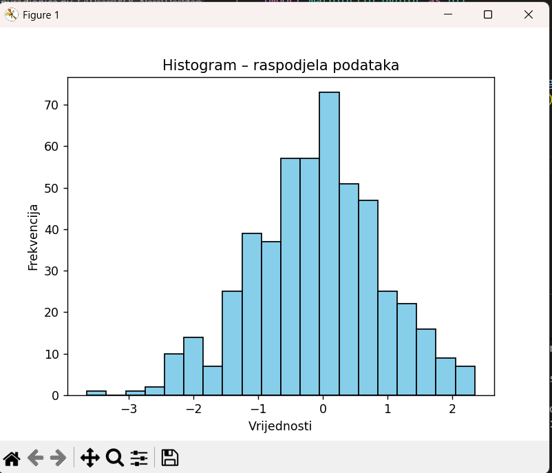
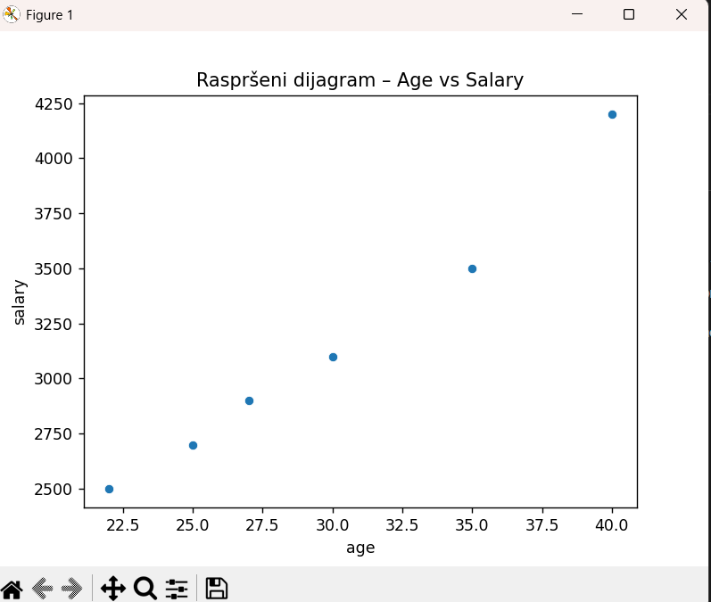
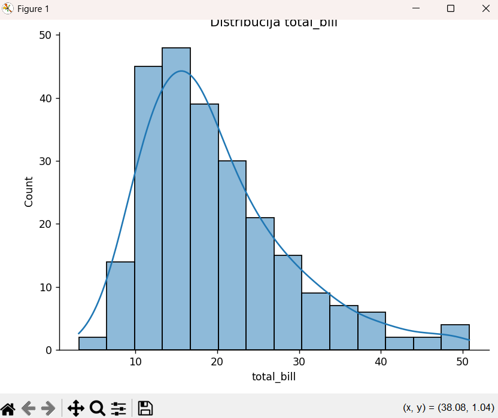
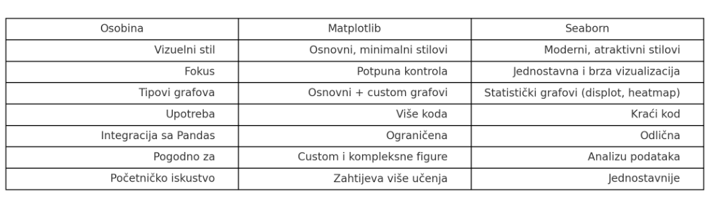

# Introduction to Data Visualization (Matplotlib and Seaborn)

Vizualizacija podataka predstavlja ključni dio procesa Data Science-a. Ona omogućava da kompleksne podatke prikažemo u obliku grafikona, čime dobijamo jasniji uvid u obrasce, trendove, odstupanja i međusobne odnose. Umjesto čitanja stotina ili hiljada vrijednosti, grafikoni nam omogućavaju da brže i intuitivnije razumijemo informacije.

U Pythonu se najčešće koriste dvije biblioteke za vizualizaciju:

🔵 Matplotlib – fleksibilna i moćna biblioteka za kreiranje grafova različitih vrsta

🔵 Seaborn – vizuelno privlačnija i jednostavnija biblioteka, izgrađena na Matplotlib-u


# Matplotlib

Matplotlib je standardna Python biblioteka za crtanje grafova. Omogućava visoku kontrolu nad svim elementima vizualizacije i pruža širok spektar grafičkih prikaza, uključujući linijske grafikone, scatter plotove, histogram, bar grafike i druge.

▶️ Primjer: Linijski grafikon

```python

import matplotlib.pyplot as plt

x = [1, 2, 3, 4, 5]
y = [10, 15, 9, 18, 12]

plt.plot(x, y, marker='o')
plt.title("Jednostavan linijski grafikon")
plt.xlabel("Vrijednosti X")
plt.ylabel("Vrijednosti Y")
plt.grid(True)

plt.show()

```
Output:


# Histogram 

Histogrami prikazuju kako su podaci raspoređeni i omogućavaju lakše uočavanje gustoće i obrasca distribucije.

``` python
import matplotlib.pyplot as plt
import numpy as np

data = np.random.randn(500)

plt.hist(data, bins=20, color='skyblue', edgecolor='black')
plt.title("Histogram – raspodjela podataka")
plt.xlabel("Vrijednosti")
plt.ylabel("Frekvencija")

plt.show()
```

Output:




# Seaborn 

Seaborn pojednostavljuje rad s vizualizacijama i omogućava kreiranje profesionalno stiliziranih grafikona uz minimalan kod. Radi direktno sa Pandas DataFrame-ovima, što ga čini idealnim za analizu podataka.

▶️ Scatter Plot sa Seaborn-om

``` python 
import seaborn as sns
import matplotlib.pyplot as plt
import pandas as pd

df = pd.DataFrame({
"age": [22, 25, 27, 30, 35, 40],
"salary": [2500, 2700, 2900, 3100, 3500, 4200]
})

sns.scatterplot(data=df, x="age", y="salary")
plt.title("Raspršeni dijagram – Age vs Salary")
plt.show()
```
Output:




# Distribucija podataka (displot)

``` python
import seaborn as sns
import matplotlib.pyplot as plt

tips = sns.load_dataset("tips")

sns.displot(tips["total_bill"], kde=True)
plt.title("Distribucija total_bill")
plt.show()

``` 
Output:




# Poređenje Matplotlib i Seaborn




# Zaključak
U ovoj lekciji upoznali smo se s dvije ključne biblioteke za vizualizaciju podataka u Pythonu — Matplotlib i Seaborn. Matplotlib nam pruža potpunu kontrolu nad izgledom grafikona i predstavlja osnovu većine vizualizacija, dok Seaborn omogućava brzu i estetski privlačniju izradu statističkih prikaza. Kroz primjere linijskih grafikona, histograma, raspršenih dijagrama, distribucija i korelacionih matrica, vidjeli smo kako vizualizacija pomaže da kompleksni podaci postanu razumljivi i korisni.

Vizualizacija je neizostavan korak u Data Science-u jer omogućava prepoznavanje obrazaca, trendova i veza koje se teško mogu uočiti u sirovim podacima. Ovladavanje Matplotlib-om i Seaborn-om čini temelj za sve buduće analize, prezentacije i izgradnju naprednih modela mašinskog učenja.