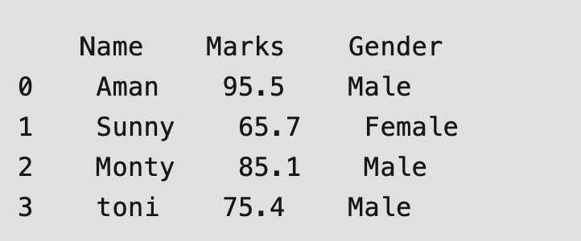
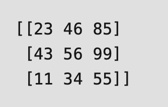
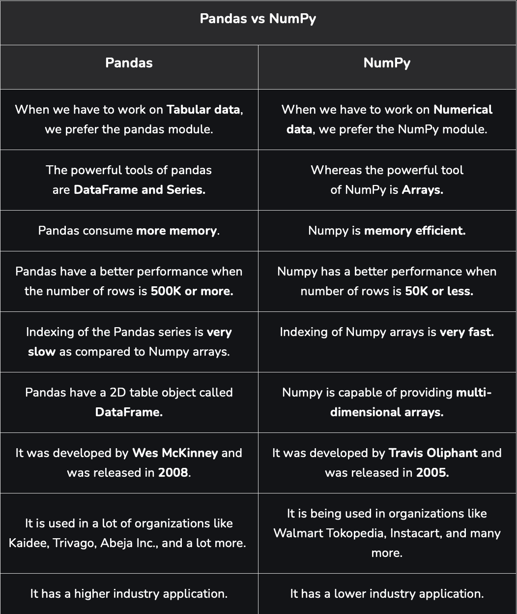

# Working with Data - Numpy and Pandas Libraries
Python je jedan od najpopularnijih programskih jezika za mašinsko učenje (Machine Learning), analizu podataka (Data Analysis) i duboko učenje (Deep Learning). Njegova snaga leži u bogatom skupu biblioteka koje korisniku omogućavaju potpunu kontrolu nad podacima.
Danas ćemo se upoznati s dvije najpoznatije Python biblioteke — NumPy i Pandas, te ih međusobno uporediti.

# Pandas
Pandas je open-source biblioteka s BSD licencom, napisana u programskom jeziku Python. Ona nudi brze, efikasne i jednostavne strukture podataka te alatke za analizu podataka, posebno pogodna za manipulaciju numeričkim podacima i vremenskim serijama.
Pandas je izgrađen na osnovu NumPy biblioteke i napisan kombinacijom jezika Python, Cython i C.
Pomoću Pandas biblioteke moguće je uvoziti podatke iz različitih formata kao što su JSON, SQL baze podataka, Microsoft Excel i mnogi drugi.

```python

# Importing pandas library
import pandas as pd

# Creating and initializing a nested list
age = [['Aman', 95.5, "Male"], ['Sunny', 65.7, "Female"],
       ['Monty', 85.1, "Male"], ['toni', 75.4, "Male"]]

# Creating a pandas dataframe
df = pd.DataFrame(age, columns=['Name', 'Marks', 'Gender'])

# Printing dataframe
df

```

Output:



# NumPy

NumPy je osnovna biblioteka u Pythonu koja se koristi za naučno računanje. Ona omogućava rad s višedimenzionalnim nizovima (arrays) visokih performansi i pruža alate za njihovu obradu.

NumPy niz (array) predstavlja mrežu vrijednosti istog tipa, koja se indeksira pomoću n-torki pozitivnih cijelih brojeva. NumPy nizovi su brzi, jednostavni za razumijevanje i korisnicima omogućavaju efikasno izvođenje matematičkih i logičkih operacija nad cijelim nizovima podataka.

``` python 
# Importing Numpy package
import numpy as np

# Creating a 3-D numpy array using np.array()
org_array = np.array([[23, 46, 85],
                      [43, 56, 99],
                      [11, 34, 55]])

# Printing the Numpy array
print(org_array)
```

Output: 



# Razlike između Pandas i NumPy

Pandas i NumPy su dvije odlične biblioteke koje korisniku omogućavaju rad s podacima u Pythonu. Međusobno su različite u svojoj strukturi podataka i u načinu na koji se koriste.



# Zaključak

Uradili smo uporednu analizu biblioteka Pandas i NumPy, objašnjavajući glavne razlike između njih. Također smo ih ukratko predstavili uz primjere, kako bi se bolje razumjela njihova svrha i primjena.
Obje biblioteke — NumPy i Pandas — imaju izuzetno važnu ulogu u Python programiranju, svaka u svom području.
Pandas je koristan za organizaciju podataka u redove i kolone, što olakšava njihovo čišćenje, analizu i manipulaciju, dok je NumPy idealan za efikasno izvođenje matematičkih operacija nad sirovim numeričkim podacima.