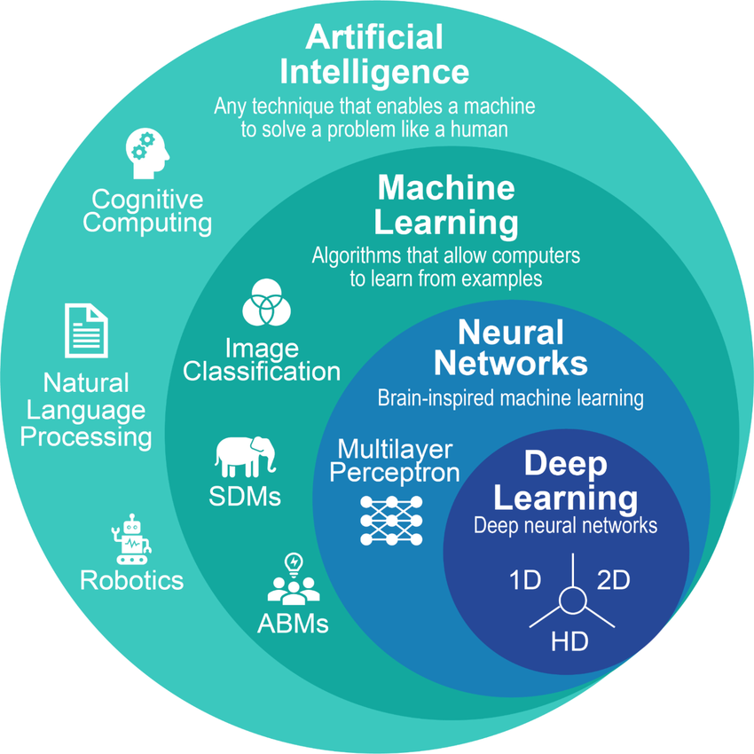
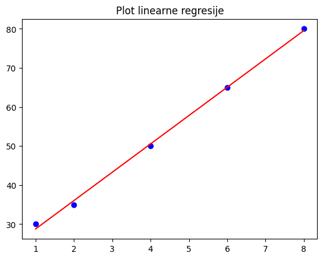
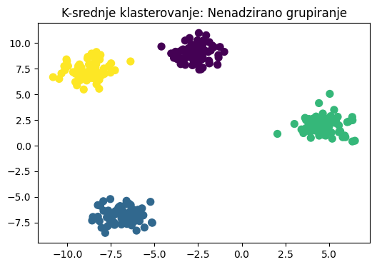

# Introduction to Machine Learning

## 1. Koncept i osnove

### 1.1 Definicija mašinskog učenja (machine learning) 🤖
Mašinsko učenje je podskup vještačke inteligencije (AI) koji kompjuterima daje sposobnost da **uče iz podataka** bez eksplicitno specificiranih pravila, koja, za primjer, vrijede u programskim jezicima.

* *Tradicionalno programiranje:* Dajete kompjuteru **Podatke** + **Pravila** (Kod) $\rightarrow$ Dobijate **Odgovore**.
* *Mašinsko učenje (ML):* Dajete kompjuteru **Podatke** + **Odgovore** (Oznake) $\rightarrow$ On pronalazi **Pravila** (Model).


### 1.2 Workflow mašinskog učenja ➡️
Proces općenito slijedi ove korake:
1.  **Prikupljanje i predobrada podataka:** Prikupljanje i čišćenje nestrukturisanih podataka radi dobivanja boljeg razumijevanja.
2.  **Treniranje modela:** Ubacivanje podataka u algoritam radi minimiziranja greške.
3.  **Inferencija (Predviđanje):** Korištenje obučenog modela za predviđanje ishoda na novim, neviđenim podacima.

---

## 2. Hijerarhija i tipovi 📊

### 2.1 Tri stuba klasičnog mašinskog učenja
| Tip | Uloga | Primjer |
| :--- | :--- | :--- |
| **Nadzirano učenje (supervised)** | Uči iz označenih podataka (Ulaz $X$ i Izlaz $Y$). | Predviđanje cijena kuća (**Regresija**) ili klasifikacija emailova kao spam (**Klasifikacija**). |
| **Nenadzirano učenje (unsupervised)** | Pronalazi skrivene strukture u neoznačenim podacima. | Segmentacija kupaca, pronalaženje različitih grupa u podacima (**Klasterovanje**). |
| **Učenje potkrepljenjem (reinforcement)** | Agent uči metodom pokušaja i pogreške koristeći nagrade/kazne. | Obuka robota za hodanje, umjetna inteligencija za igre. |

### 2.2 Deep learning: Princip ljudskog mozga 🧠
Duboko učenje (**Deep learning**) je moćan, specijalizovani podskup ML koji koristi **Neuronske mreže** (slojevite matematičke strukture).

* **Ključna razlika:** Najveća snaga deep learning-a je *Automatsko izvlačenje karakteristika*. Dok klasični ML zahtijeva od ljudi da kažu modelu koje karakteristike da traži, deep learning sam pronalazi te karakteristike.
* **Najbolje za:** Nestrukturirane podatke poput slika, videa i prirodnog jezika (ChatGPT, Gemini, Claude, Sora AI itd.).

<div style="text-align: center;">
    
</div>


---

## 3. Računarski troškovi i alati 💸

### 3.1 Potreba za specijalizovanim hardverom
Deep learning za treniranje modela zahtjeva milijarda simultanih operacija nad matricama (*matrična multiplikacija*). Ovo zahtijeva paralelno izvršavanje zadataka.

* **CPU (Centralna procesorska jedinica):** Prespor za treniranje neuronskih mreža.
* **GPU (Grafička procesorska jedinica):** *Neophodan* za deep learning. Hiljade jezgara omogućavaju simultano izvođenje hiljada matematičkih operacija.

### 3.2 Okruženje: Google Colab 🛠️
**Google Colab** je besplatno, u pregledniku bazirano Jupyter Notebook okruženje koje omogućava obradu i analizu podataka kao i treniranje modela mašinskog učenja.
* **GPU Pristup:** Colab pruža besplatan, privremeni pristup moćnim **grafičkim karticama** (poput T4).
* **Postavka:** Meni $\rightarrow$ `Runtime` $\rightarrow$ `Change runtime type` $\rightarrow$ Odaberite **T4 GPU**.

---

## 4. Praktični primjeri koda 💻

Za pokazivanje primjera koda biti će korištena **Scikit-Learn** Python biblioteka za klasično mašinsko učenje i **TensorFlow/Keras** za deep learning.<br>
Mašinsko učenje obuhvata bezbroj različitih pristupa i modela koji imaju upotrebu u različitim oblastima, ovdje će biti pokazano par primjera.

### Primjer 1: Linearna regresija (Predviđanje kontinualnih vrijednosti)
**Tip:** Nadzirana regresija (supervised regression)

```python
import numpy as np
import matplotlib.pyplot as plt
from sklearn.linear_model import LinearRegression

# Podaci: Godine iskustva vs. plata
X = np.array([1, 2, 4, 6, 8]).reshape(-1, 1) 
y = np.array([30, 35, 50, 65, 80])          

model = LinearRegression()
model.fit(X, y)

print(f"Predviđena plata za 10 godina: ${model.predict([[10]])[0]:.2f}k")

# Vizualizacija
plt.scatter(X, y, color='blue', label='Stvarni podaci')
plt.plot(X, model.predict(X), color='red', label='Linija modela')
plt.title('Plot linearne regresije')
plt.show()
```

Rezultat programa:

<div style="text-align: center;">
    
</div>


### Primjer 2: Stablo odluke / Decision tree (Predviđanje kategorija)
**Tip:** Nadzirana klasifikacija (supervised classification)

```python
from sklearn.tree import DecisionTreeClassifier
from sklearn.datasets import load_iris
from sklearn.model_selection import train_test_split

# Podaci: Klasifikacija cvijeta Iris
iris = load_iris()
X_train, X_test, y_train, y_test = train_test_split(iris.data, iris.target, random_state=42)

# Treniranje
model = DecisionTreeClassifier(max_depth=3) 
model.fit(X_train, y_train)

# Izlaz
score = model.score(X_test, y_test)
print(f"Tačnost stabla odluke: {score:.2f}")
print(f"Predviđanje uzorka 1: {iris.target_names[model.predict(X_test[:1])[0]]}")
```

### Primjer 3: K-srednje klasterovanje (Pronalaženje grupa)
**Tip:** Nenadzirano učenje (unsupervised learning)

```python
import matplotlib.pyplot as plt
from sklearn.cluster import KMeans
from sklearn.datasets import make_blobs

# 1. Generisanje podataka (Samo X, BEZ oznaka y)
X, _ = make_blobs(n_samples=300, centers=4, cluster_std=0.8, random_state=42)

# 2. Treniranje: Tražimo da pronađe 4 klastera (K=4)
model = KMeans(n_clusters=4, random_state=42, n_init=10)
model.fit(X)
labels = model.labels_

# 3. Vizualizacija
plt.figure(figsize=(6, 4))
plt.scatter(X[:, 0], X[:, 1], c=labels, s=50, cmap='viridis')
plt.title("K-srednje klasterovanje: Nenadzirano grupisanje")
plt.show()
```
Rezultat programa:

<div style="text-align: center;">
    
</div>

### Primjer 4: Deep learning (Neuronske mreže)
**Tip:** Prepoznavanje slika

```python
import tensorflow as tf

# 1. Definisanje strukture neuronske mreže (3 sloja)
model = tf.keras.models.Sequential([
  tf.keras.layers.Flatten(input_shape=(28, 28)), # Ulazni sloj 
  tf.keras.layers.Dense(128, activation='relu'), # Skriveni sloj 
  tf.keras.layers.Dense(10, activation='softmax') # Izlazni sloj 
])

# 2. Definisanje procesa učenja
model.compile(optimizer='adam',
              loss='sparse_categorical_crossentropy',
              metrics=['accuracy'])

print("Struktura neuronske mreže definisana.")
print("Model je sada spreman za treniranje koristeći model.fit(podaci, oznake, epochs=5).")
```

## 5. Zaključak i sljedeći koraci 🏁

### Sažetak ključnih tačaka
* **ML vs deep learning:** **Mašinsko učenje** je širok pojam za modele koji uče iz podataka; **Deep learning** je specijalizovani podskup koji koristi slojevite mreže, idealan za složeno prepoznavanje obrazaca u nestrukturiranim podacima (slike, tekst, zvuk).
* **Potreba za podacima:** Svaki tip mašinskog učenja, a posebno deep learning, konstantno zahtijeva ogromne količine **kvalitetnih podataka**. Glavni razlog preciznosti današnjih modela je broj kvalitetnih podataka.
* **Računarski troškovi:** Treniranje složenih modela zahtijeva specijalizovani hardver (**GPU**). Alati poput Google Colab-a čine ovo dostupnim.
* **Proces je iterativan:** Izgradnja ML modela nije jednokratni zadatak programiranja, to je kontinuirani ciklus *prikupljanja podataka, treniranja, testiranja i prerađivanja* modela dok ne postigne željene performanse.

## Dodatak: Resursi za samostalno učenje

Nakon završenog uvoda, sljedeći korak je praktičan rad. Ovdje su neki od dobrih resursa za nastavak vašeg putovanja u mašinsko učenje:

### 📚 Knjige (Teorija i praksa)
* **Hands-On Machine Learning with Scikit-Learn, Keras & TensorFlow** (Aurélien Géron): Najbolja praktična knjiga za početnike i srednji nivo..
* **The Hundred-Page Machine Learning Book** (Andriy Burkov): Odličan kratki pregled ključnih koncepata, idealan za brzo utvrđivanje teorije.

### 🌐 Platforme i Skupovi podataka (Dataseti)
* **Kaggle:** Nezaobilazna platforma. Pruža:
    * Milijarde skupova podataka (datasets) za vježbanje.
    * **Kaggle Notebooks (Kernels):** Okruženje slično Colab-u.
    * Takmičenja (competitions) za testiranje vještina.
* **Huggingface:** Pltaforma koja sadrži mnoštvo skupova podataka, pretreniranih modela, kurseva za učenje.

### 📺 YouTube kanali (Vizualizacija i tutorijali)
* [StatQuest with Josh Starmer](https://www.youtube.com/@statquest): Fenomenalan kanal za vizualno, intuitivno objašnjavanje složenih algoritama.
* [3Blue1Brown](https://www.youtube.com/@3blue1brown): Odličan kanal za stvaranje moćne matematičke intuicije za mašinsko učenje.
* [DeepLearning.AI (Andrew Ng)](https://www.youtube.com/@DeeplearningAI): Izvor za učenje od jednog od pionira Dubokog učenja.